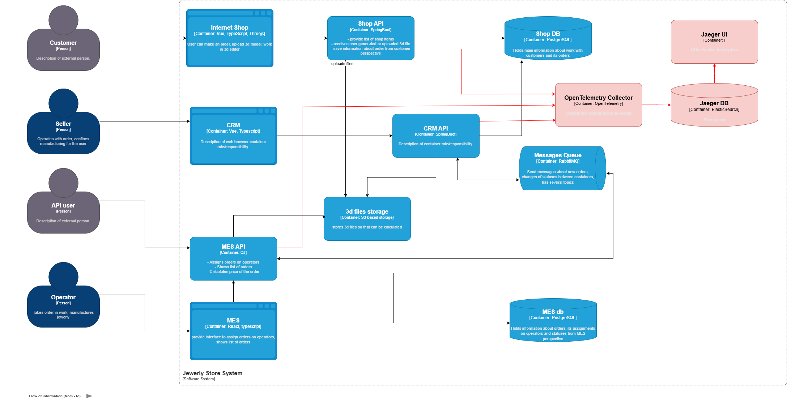

# Архитектурное решение по трейсингу
Основные маршруты которые следует покрыть трейсингом:
- Customer -> Internet Shop -> Shop API -> 3d storage | Shop DB
- Seller -> CRM -> CRM API -> 3d storage | RabbitMQ
- API user -> MES API -> 3d storage | MES DB
- Operator -> MES -> MES API -> 3d storage | MES DB

Данные, которые должны попадать в трейсинг:
- trace-id — Id трейса
- span-id — Id спана
- user-id — Id пользователя
- order-id — Id заказа
- timestamp — временная метка
- endpoint-name — название endpoint'а
- staus — текущий статус заказа

## Мотивация
Логи и метрики не дают полной картины происходящего в недрах системы, т.к. направлены, в основном, на сбор технической информации и не могут охватить все аспекты жизненного цикла заказа. Трейсинг позволяет отследить путь запроса в приложении и может помочь определить точку, в которой происходит "зависание" заказа. 

## Предлагаемое решение
Для реализации трейсинга будет использоваться платформа OpenTelemetry для сбора и передачи данных о трейсах, метриках и логах из приложений, а также Jaeger для визуализации и анализа трейсинга.

Для внедрения трейсинга необходимо настроить интеграцию OpenTelemetry SDK во все микросервисы и развернуть OpenTelemetry Collector. Также необхоимо развернуть Jaeger-сервер и базу данных для хранения данных трейсинга (Elasticsearch).

## Компромиссы
- Внедрение трейсинга потребует большого количества ресурсов для хранения и обработки результатов, а также может негативно повлиять на скорость выполнения запросов при больших нагрузках. Данную проблему может частично решить выборочная отправка спанов — отправляется 10% от всех спанов и спаны, в которых произошли ошибки.

- Внедрение OpenTelemetry потребует изменений в коде API и сервисов, что потребует времени и ресурсов команды. На первом этапе целесообразно настроить трейсинг перехода между состояниями заказа PRICE_CALCULATED -> MANUFACTURING_APPROVED -> MANUFACTURING_STARTED, на котором наиболее вероятно "зависание" заказа, а расширение трейсинга оставить на будущее. 

В целом, трейсинг целесообразно внедрять после внедрения мониторинга и логирования (см. есть возможность выполнить только три пункта в ближайшие полгода), так как это достаточно дорого и трудоёмко. Внедрение мониторинга и логирование хоть и не решат проблему полностью, но могут дать весьма неплохой результат в перспективе полугода, а трейсинг можно оставить на будущее. 

## Аспекты безопасности
Доступ к данным трейсинга должны иметь только сотрудники поддержки и разработчики (обеспечивается системой авторизации и аутентификации, в которой проблем нет). Доступ должен быть ограничен корпоративной сетью или доступом по VPN для удалённых сотрудников.
Также в данные трейсинга не должны включаться персональные данные клиентов и пароли.