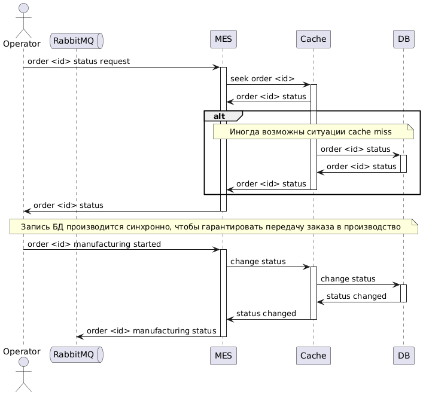

# Архитектурное решение по кешированию
По описанию проблем можно заключить, что задержки при доступе операторов возникают при загрузке данных из БД MES, также возможно что проблема с "зависанием" заказов частично происходит из-за перегрузки БД. Таким образом, в первую очередь, необходимо внедрить кеширование для запросов из БД MES.

В дальнейшем необходимо будет реализовать кеширование также для Shop API и CRM API, так как в будущем уже они могут стать узким местом. Приоритет и срочность этого шага нужно следует определить на основе анализа метрик и логов.

Также можно кешировать результаты расчёта стоимости по 3D-модели изделия, в этом случае для повторный расчёт одной и той же 3D-модели будет происходить практически мгновенно, но это мероприятие также можно отложить на будущее. Есть предположение, что для заказной разработки повторяемость моделей будет низкой, но, тем не менее, для B2B клиентов может быть актуально. Решение о необходимости и приоритете данного шага  необходимо принимать после анализа актуальности данного сценария на основе логов.

## Мотивация
Операторы жалуются на медленную загрузку заказов уже сейчас, таким образом проблема с быстродействием очевидна. Попытки исправить ситуацию с помощью пагинации не увенчалась успехом, поэтому нужно принимать более радикальные меры.
Кеширование запросов к MES DB должно дать очень хороший результат, так как особенность процесса работы над заказом такова, что статусы заказов меняются медленно (редкая запись) и большую часть статусов можно закешировать (операторам интересны в основном новые заказы).

Внедрение кеширования позволит:
- повысить скорость получения и записи данных (от операторов не будет жалоб)
- снизить нагрузку на систему (возможно частично решится проблема с потеряными заказами)

## Предлагаемое решение
Для MES API предлагается использовать серверное кеширование с использованием комбинации паттернов Read-Through и Write-Through. 
Операторам важно получать актуальную информацию и они постоянно обновляют стартовую страницу в поисках новых заказов, поэтому операции чтения происходят достаточно часто. При этом статус заказа меняется относительно редко, поэтому задержки в передаче данных (недостаток паттерна Write-Through) не так важны. 
Ограничения на модель данных в кеше и в БД для данного сценария не критичны, так как не используются сложные запросы.
Относительно низкая стоимость и меньшая сложность приложения относительно паттерна Cache-Aside также являеются преимуществом в данном случае, так как позволяют относительно быстро внедрить кеширование и получить видимый результат.

При использовании паттерна Write-Through запись данных идёт через кеш, поэтому нет необходимости в ручной инвалидации, также не будет кеш-промаха при первом запросе (нивелируется недостаток паттерна Read-Through).